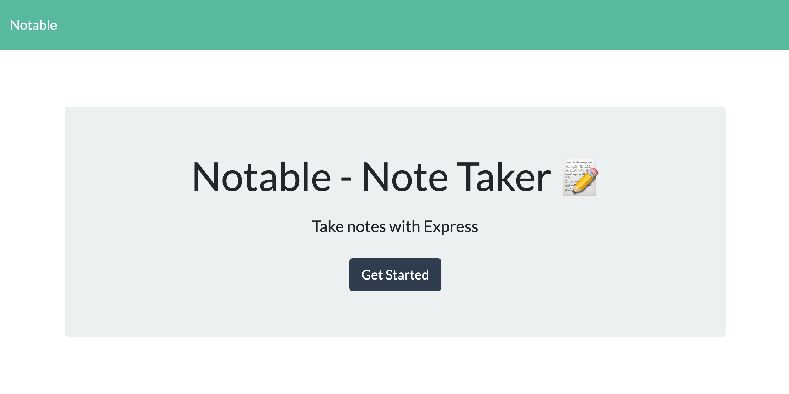
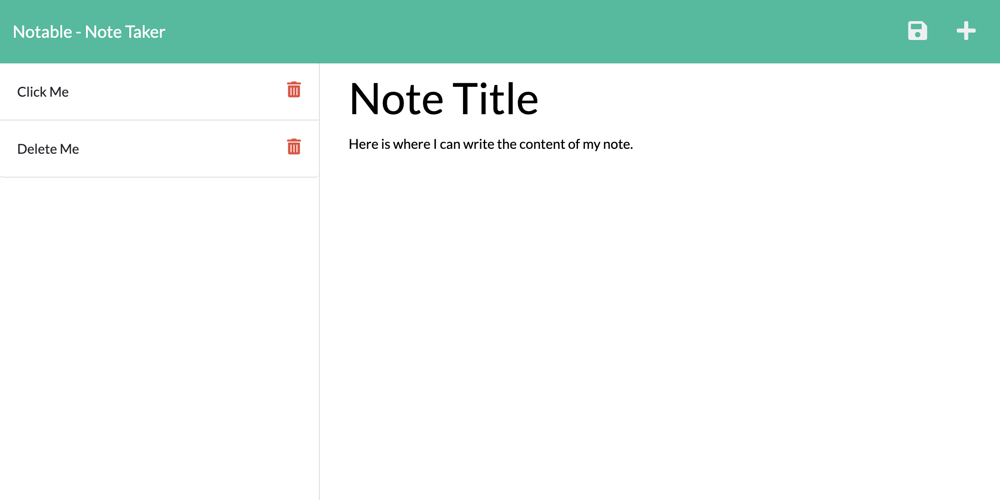

# NOTABLE

## Description
An Express.js note taking application

## Table of Contents
* [Installation](#installation)
* [Usage](#usage)
* [License](#license)
* [Contributing](#contributions)
* [Tests](#tests)
* [Questions](#questions)

## Installation
Install this applicatioin by cloning our repository from github to your device.

## Usage
Use our application by visiting the Herolu Deployment:
https://guarded-bastion-63529.herokuapp.com/

## License
None

## Contributing
This application is not open-source at this time. Feel free to fork or clone the repo to further develop this application for your own use!

## Tests
No testing required

## Additional Info
* Github: [kalecodes](https://github.com/kalecodes)
* Project Repo: [Notable](https://github.com/kalecodes/notable)